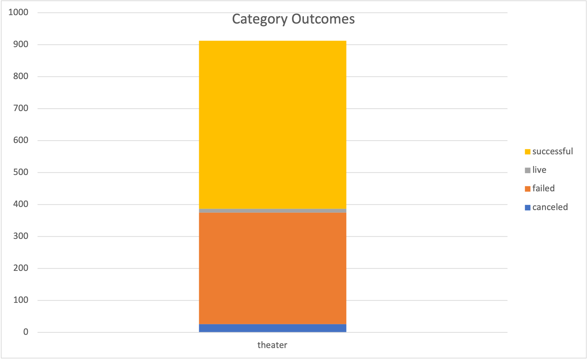
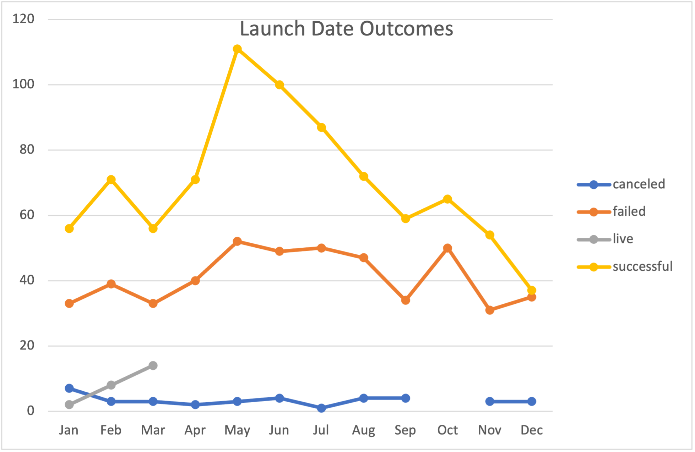

# kickstarter-analysis
Performing analysis on kickstarter data to uncover trends

##Overview##
The purpose of this analysis is to help Louise launch a successful crowdfunding campaign for her play. By using data from other crowdfunding campaigns, our analysis helps to give guidance to Louise o make her project successful.

##Analysis and Challenges##
The analysis was performed using Excel Pivot Tables and Pivot Charts, as well as other Excel functions such as VLOOKUP, COUNTIFS, and finding valuable data such as modes, medians, and averages. Some of the results of that analysis can be seen in the charts below.

One of the challenges I encountered in this analysis was breaking down outcomes based on their goals. My final code for this part of the analysis looked like:
 
 =Kickstarter!D1:D4115,">=1000",Kickstarter!D1:D4115,"<5000"
 
But originally I left out the inequalities, which resulted in the data being inaccurate. That stumped me and killed some time.

##Results and Conclusions##
#What are two conclusions you can draw about the Theater Outcomes by Launch Date?#
Theater kickstarters are most successful around May or June, and are least successful in the Winter.

#What can you conclude about the Outcomes based on Goals?#
Campaigns with higher goals were likely to fail, while those with smaller ones were more likely to succeed. 

#What are some limitations of this dataset?#
Speaking of campaigns with higher totals, the dataset only has about three dozen play kickstarter camapigns with goals over $25,000. While this probab;y indicates that most play campaigns have smaller goals, it does make me wonder how representative that sample can be in determining the conclusion outlined above.

#What are some other possible tables and/or graphs that we could create?#
Similar charts could be made for the other subcategories of data, such as Film & Television. We could also create graphs to see how campaign goals correlate to the % funded (where goals are most likely to be exceeded and by how much).
